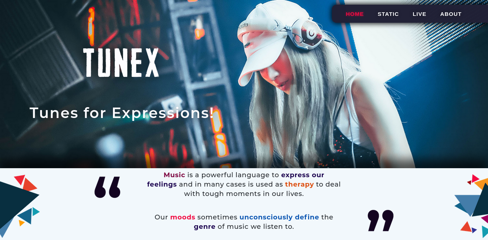

# TUNEX

**Note**: This project was a collective team effort, Models and other data collection were done with other team members working on TUNEX.
However, the main aim of this repo is to create clean and simple implementation of the whole project

Link to [Drishti Version](https://github.com/arjunparmar/TUNEX)

⇥To build a deploy-able system that detects our emotions at real time using webcam feed and smartly classifies one’s playlist into genres, at last playing a song that suits the current emotion and behavior of the person, as specified by the facial analysis.


Available on Docker, now you can go and install the app directly from [dockerhub](./Install.md)



## Timeline
<details>
<summary>Timeline followed for the project</summary>
| Date | Task |
|---|---|
|11-10| Project Assigned and Groups formed on Communication Channel |
| 12-10| [Course-1](#courses) |
| 18-10| [Course-2](#courses) |
| 24-10| [Course-3](#courses) |
| 4-11 | Read [Papers](#papers)|
| 11-11 | Finalised the approach and the [Emotions](#emotions) to detect|
| 14-11 | Selection of Dataset and processing|
| 22-11 | Face Detection using Harcascade|
| 29-11 | Dataset augmented and finalised|
| 22-12 | Model Training |
</details>

## Emotions

- Afraid :fearful:
- Angry :angry:
- Disgust :unamused:
- Happy :smiley:
- Neutral :neutral_face:
- Sad :sob:
- Suprised :open_mouth:

## Dataset 
[Google Drive link](https://drive.google.com/file/d/1U1F9L56AX-Vnk0EG4FZWowh9WEIBH_M4/view?usp=sharing)

## Demo
[Facebook Post](https://www.facebook.com/100005205645669/videos/1636682486515257/)

<details>
<summary><b> Courses</b></summary>

- Course 1 - [Neural Networks and Deep learning](https://www.coursera.org/learn/neural-networks-deep-learning?specialization=deep-learning)
- Course 2 - [Improving Deep Neural Networks](https://www.coursera.org/learn/deep-neural-network?specialization=deep-learning)
- Course 3 - [Convolutional Neural Networks](https://www.coursera.org/learn/convolutional-neural-networks?specialization=deep-learning)
</details>


## Papers

- [Emotion Detections using facial expression recognition and EEG](https://ieeexplore.ieee.org/document/7753378)
- [Real Time Emotion Recognition System using Facial Expressions and EEG](https://www.sciencedirect.com/science/article/pii/S235291482030201X)
- [Music Recommendation System](b2b.musicovery.com)
- [Smart Music Player Integrating facial emotion recognition and music mood recommendation](https://ieeexplore.ieee.org/abstract/document/8299738)
- [Facial Expression Recognition using Facial Landmarks and Random Forest Classifier](https://www.researchgate.net/publication/325674764_Facial_Expression_Recognition_Using_Facial_Landmarks_and_Random_Forest_Classifier)
- [Facial Expression Recognition using Facial Landmark Detection and Feature Extraction via Neural Networks](https://arxiv.org/pdf/1812.04510.pdf)
- [Intraface model to extract features](https://www.ri.cmu.edu/pub_files/2015/5/intraface_final.pdf)


<details>
<summary><b> Errors Faced</b></summary>

1. In HaarCascade to detect face, we have to import a xml file which is already present in OpenCV, but when I was doing
```python
face_cascade = cv2.CascadeClassifier('haarcascade_frontalface_default.xml')
#The above xml file was not detected
#maybe because it was not stored in bin of OpenCV as I had installed opencv in miniconda environment

```
   To overcome it, I did [this](https://github.com/arjunparmar/TUNEX/blob/main/Himanshu/faceDet.py#L4)  

2. Installing DLib without Pycharm environment:
   using
   ```bash
   pip install dlib
   ```
   give errors because several other packages are required before using this command. To know more refer [this](https://www.pyimagesearch.com/2017/03/27/how-to-install-dlib/?fbclid=IwAR1h_ZFwcqXMdE8zGgrVYcgwH1RntRNe0_Nw1dsJw6K7chn7sZ6aDTUhskQ)
   


3.  While arranging the files in the KDEF dataset, You may encounter a key error on Images 'AF31V.JPG' and 'AM31H.JPG'. The reason for the same is we have seven emotions that are thoroughly documented these two images or least their names do not qualify to our expectations and hence can be removed prior to running this [script](https://github.com/arjunparmar/TUNEX/blob/main/Gaurav/arranging_data.py) or [this](https://github.com/arjunparmar/TUNEX/blob/main/Gaurav/reading_data.py).

4. [Visualizing Data in Terminal](https://hackernoon.com/visualizing-data-in-terminal-using-lehar-7cfded09c1ad)

5. [Visualizing Data in Terminal without Lehar](https://stackoverflow.com/questions/36269746/matplotlib-plots-arent-shown-when-running-file-from-bash-terminal)


</details>

Made with :heart: by DRISHTI-AI/ML Team.
